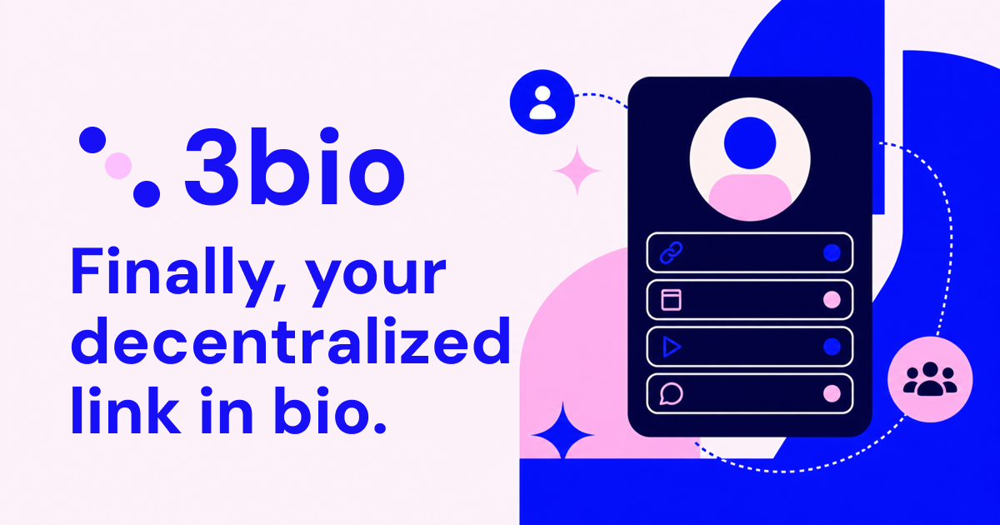

# 3bio

A customizable, open-source link-in-bio for Lens profiles.

> [!NOTE]
> **Alpha status:** 3bio is ready for early testing, but rough edges are
> expected. Editor saves publish real metadata to Lens mainnet.

[Visit 3bio](https://3bio.social) ·
[Open the dashboard](https://3bio.social/app/dashboard) ·
[Run locally](#local-development) · [Self-host 3bio](./docs/self-hosting.md)



## What is 3bio?

3bio turns a Lens handle into a shareable page for identity, links, social
profiles, and Lens profile statistics. Every existing handle has a predictable
public URL at `3bio.social/{handle}`.

Creators can connect the wallet that owns or manages their Lens profile, edit
their page with a live preview, and publish the result through Lens. 3bio
preserves native Lens fields and unrelated attributes while storing presentation
settings in a dedicated `3bio` metadata attribute.

## Features

- Public profile pages for existing Lens handles at `/{handle}`.
- Wallet authentication and selection between Lens profiles owned or managed by
  the connected wallet.
- A live editor for names, bios, avatars, social-share images, button links, and
  supported social profiles.
- Three visual themes, an optional links-panel background, reorderable social
  links, and configurable 3bio branding.
- Optional display of Lens follower, following, and post counts.
- Images and profile configuration published through Lens and Grove while
  preserving native Lens metadata and unrelated attributes.
- Search- and share-ready profile titles, canonical URLs, structured metadata,
  and social previews.

## How it works

Anyone can view an existing Lens handle at `3bio.social/{handle}` without
signing in. To create or update a page:

1. Open the 3bio dashboard and connect a wallet.
2. Select a Lens profile that wallet owns or manages.
3. Customize the page, preview the result, and save the metadata through Lens.
4. Share the public `3bio.social/{handle}` URL anywhere.

## Local development

You need [Git](https://git-scm.com/) and Bun `1.3.13`.

```sh
git clone https://github.com/NicolasMilliard/3bio.git
cd 3bio
bun install --frozen-lockfile
bun run dev
```

No environment file is required for local development. When `VITE_PUBLIC_ORIGIN`
is unset, 3bio uses the current browser origin for client-rendered links and
metadata. Copying `.env.example` unchanged would instead point those values at
the production site.

> [!IMPORTANT] The editor is configured for Lens mainnet. Saving from a local
> build can publish real metadata updates to the selected Lens profile. Use a
> profile you are comfortable modifying.

### Commands

| Command           | Purpose                                                              |
| ----------------- | -------------------------------------------------------------------- |
| `bun run dev`     | Start the Vite development server.                                   |
| `bun test`        | Run the Bun test suite.                                              |
| `bun run lint`    | Run ESLint.                                                          |
| `bun run build`   | Type-check the app and Pages Function, then build production assets. |
| `bun run preview` | Preview the production client build locally.                         |

The Vite servers do not run the Cloudflare Pages Function, so local preview is
not production-equivalent. See the guide's
[production-routing notes](./docs/self-hosting.md#6-understand-the-production-routing)
for details.

## Fork and self-host

3bio is designed to be forked and can be deployed through Cloudflare Pages
without a database or private runtime credentials. A branded fork needs more
than a single environment-variable change because the crawler-visible homepage
metadata and public files also contain the production name and origin.

Follow the [fork and self-hosting guide](./docs/self-hosting.md) for the
complete branding checklist, Cloudflare settings, custom-domain setup, routing
notes, and post-deployment checks.

## Tech stack

3bio is built with React 19, TypeScript, Vite, TanStack Router and Query, Lens
Protocol, Wagmi, Viem, Tailwind CSS, and Cloudflare Pages Functions.

## Contributing

Issues and focused pull requests are welcome. Before opening a pull request,
run:

```sh
bun test
bun run lint
bun run build
```

## License

3bio's source code and original project assets are available under the
[MIT License](./LICENSE). That license does not grant rights to user-generated
content, Lens profile content, or third-party names and trademarks.
